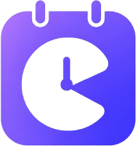

# Cally

### Smart Appointment Scheduling Platform

Cally is a full-stack appointment scheduling platform that makes it easy for hosts to create meeting events, define their availability, and allow guests to book available time slots without the usual back-and-forth communication.

The platform integrates **Google Calendar** and **Google Meet** to automatically create meetings and provides email notifications for booking confirmations and cancellations.

---

## ✨ Features

### 👤 Authentication

- User registration
- OTP-based email verification
- Secure password hashing
- JWT-based authentication
- Access token and refresh token system
- HTTP-only refresh token cookie
- Protected dashboard routes
- Secure logout

### 📅 Event Management

Hosts can:

- Create meeting events
- Set event duration
- Add event descriptions
- Customize event information
- Edit events
- Delete events
- Generate public event booking links

### 🕐 Availability Management

Hosts can:

- Configure weekly availability
- Set multiple availability windows per day
- Define when guests can book meetings
- Manage their scheduling availability

Example:

```text
Monday
09:00 - 10:00
12:00 - 13:00

Tuesday
09:00 - 10:00
12:00 - 13:00
```

### 📖 Booking System

Guests can:

- Open a host's public booking page
- Select a date
- View available time slots
- Select a meeting time
- Enter their information
- Confirm a booking

The backend automatically prevents overlapping bookings.

### 🔄 Conflict Detection

Cally checks existing bookings before confirming a new meeting.

For example:

```text
Existing booking
09:00 ───────── 10:00

New 30-minute booking:

09:00 ── 09:30     ❌
09:30 ── 10:00     ❌
09:45 ── 10:15     ❌
10:00 ── 10:30     ✅
```

This allows different event types and durations to coexist without creating scheduling conflicts.

### 🗓️ Google Calendar Integration

Hosts can connect their Google Calendar.

After a guest books a meeting:

```text
Booking
   ↓
Google Calendar Event
   ↓
Google Meet Link
   ↓
Guest + Host added as attendees
```

The generated Google Meet link is stored with the booking and can be displayed to the host and guest.

### 📧 Email Notifications

Cally automatically sends emails for:

- Booking confirmation
- Booking cancellation

The confirmation email can include:

- Guest name
- Host name
- Event title
- Date
- Start time
- End time
- Google Meet link

### ❌ Booking Cancellation

Hosts can cancel confirmed bookings.

Cancellation performs:

1. Remove the Google Calendar event.
2. Send a cancellation email.
3. Mark the booking as `cancelled`.
4. Preserve the booking record for history.

---

# 🏗️ System Architecture

```text
                         ┌───────────────────┐
                         │      Guest        │
                         └─────────┬─────────┘
                                   │
                                   ▼
                         ┌───────────────────┐
                         │  React Frontend   │
                         │   TypeScript      │
                         │   Tailwind CSS    │
                         └─────────┬─────────┘
                                   │
                              REST API
                                   │
                                   ▼
                         ┌───────────────────┐
                         │ Node.js + Express │
                         │     Backend       │
                         └───────┬───┬───────┘
                                 │   │
                    ┌────────────┘   └──────────────┐
                    ▼                               ▼
             ┌─────────────┐               ┌────────────────┐
             │   MongoDB   │               │  Google APIs   │
             │             │               │ Calendar/Meet  │
             └─────────────┘               └────────────────┘
                                                     │
                                                     ▼
                                             ┌─────────────┐
                                             │   Email     │
                                             │  Service    │
                                             └─────────────┘
```

---

# 🔄 Booking Workflow

```text
Guest opens public event page
              ↓
       Selects a date
              ↓
      Fetch available slots
              ↓
    Check host availability
              ↓
    Check existing bookings
              ↓
       Select time slot
              ↓
        Submit booking
              ↓
      Validate booking again
              ↓
       Create DB booking
              ↓
   Create Google Calendar event
              ↓
      Generate Google Meet
              ↓
       Store meeting link
              ↓
       Send confirmation email
              ↓
       Booking confirmed
```

---

# 🛠️ Technology Stack

## Frontend

- React
- TypeScript
- Vite
- Tailwind CSS
- React Router
- Axios
- Framer Motion
- Lucide React
- React Context API

## Backend

- Node.js
- Express.js
- MongoDB
- Mongoose
- JWT
- bcrypt
- Nodemailer
- Google Calendar API
- Google Meet

## Development Tools

- Git
- GitHub
- VS Code
- npm / pnpm

---

# 📁 Project Structure

```text
Cally/
│
├── frontend/
│   ├── src/
│   ├── public/
│   ├── package.json
│   └── README.md
│
├── backend/
│   ├── src/
│   ├── server.js
│   ├── package.json
│   └── README.md
│
├── README.md
└── .gitignore
```

---

# 🚀 Getting Started

## Prerequisites

Make sure you have installed:

- Node.js 18+
- npm or pnpm
- MongoDB / MongoDB Atlas
- Git

For Google Calendar integration, you also need:

- Google Cloud project
- Google Calendar API
- Google OAuth 2.0 credentials
- Gmail/SMTP credentials for email notifications

---

# 1. Clone the Repository

```bash
git clone <your-repository-url>
cd Cally
```

---

# 2. Setup Backend

```bash
cd backend
npm install
```

Create:

```text
backend/.env
```

Configure the required backend environment variables.

Then start the backend:

```bash
npm run dev
```

The backend normally runs at:

```text
http://localhost:3000
```

For complete backend configuration:

👉 See [`backend/README.md`](./backend/README.md)

---

# 3. Setup Frontend

Open another terminal:

```bash
cd frontend
npm install
```

Create:

```text
frontend/.env
```

Example:

```env
VITE_API_URL=http://localhost:3000/api
```

Start the frontend:

```bash
npm run dev
```

The frontend normally runs at:

```text
http://localhost:5173
```

For complete frontend configuration:

👉 See [`frontend/README.md`](./frontend/README.md)

---

# 🔐 Environment Variables

The project uses separate environment configurations for frontend and backend.

### Frontend

```env
VITE_API_URL=http://localhost:3000/api
```

### Backend

```env
PORT=3000
MONGO_URI=your_mongodb_connection_string
JWT_SECRETS=your_jwt_secret

EMAIL_SERVICE_USER=your_email@gmail.com
EMAIL_SERVICE_PASS=your_gmail_app_password

GOOGLE_CLIENT_ID=your_google_client_id
GOOGLE_CLIENT_SECRET=your_google_client_secret
GOOGLE_CALENDAR_REDIRECT_URI=http://localhost:3000/api/auth/google/calendar/callback

FRONTEND_URL=http://localhost:5173
```

⚠️ **Never commit `.env` files or secrets to GitHub.**

---

# 🔑 Authentication Architecture

Cally uses an access-token and refresh-token architecture.

```text
Login
 ↓
Backend verifies credentials
 ↓
Access Token
 ↓
Frontend
 ↓
Protected API Requests
```

The refresh token is stored in an HTTP-only cookie.

The frontend maintains the authenticated user through `AuthContext`.

Protected pages use:

```text
ProtectedRoute
      ↓
Check authentication
      ↓
User exists?
   /         Yes        No
 ↓           ↓
Dashboard   Login
```

---

# 🗓️ Google Calendar Architecture

The Google Calendar connection uses OAuth 2.0.

```text
Host
 ↓
Connect Google Calendar
 ↓
Google Consent Screen
 ↓
OAuth Callback
 ↓
Authorization Code
 ↓
Access + Refresh Tokens
 ↓
Store Refresh Token
 ↓
Calendar Connected
```

When a booking is created:

```text
Booking
   ↓
Google Calendar API
   ↓
Calendar Event
   ↓
Google Meet Conference
   ↓
Meet Link
```

---

# 📧 Email Architecture

The backend uses Nodemailer for transactional emails.

```text
Booking Created
      ↓
Backend
      ↓
Nodemailer
      ↓
Gmail SMTP
      ↓
Guest Email
```

Cancellation follows a similar process.

---

# 🧪 Testing

A complete test flow can be performed using the following steps:

### Authentication

- [ ] Register
- [ ] Receive OTP
- [ ] Verify OTP
- [ ] Login
- [ ] Access dashboard
- [ ] Logout
- [ ] Verify protected routes

### Event Management

- [ ] Create event
- [ ] Edit event
- [ ] Delete event
- [ ] Open public event link

### Availability

- [ ] Configure availability
- [ ] Configure multiple time windows
- [ ] Verify available slots

### Booking

- [ ] Select date
- [ ] Select time
- [ ] Submit booking
- [ ] Verify booking
- [ ] Test conflicting booking
- [ ] Verify unavailable slots

### Google Integration

- [ ] Connect Google Calendar
- [ ] Create booking
- [ ] Verify Calendar event
- [ ] Verify Google Meet link
- [ ] Cancel booking
- [ ] Verify Calendar event removal

### Email

- [ ] Booking confirmation email
- [ ] Cancellation email
- [ ] Verify Meet link in email

---

# 🔒 Security

The application implements several security practices:

- Password hashing using bcrypt
- OTP hashing
- JWT authentication
- HTTP-only refresh-token cookie
- Protected API routes
- User ownership checks
- Booking conflict validation
- Environment-based secrets
- Google OAuth credentials stored on the backend

For production deployment, HTTPS, secure cookies, restricted CORS, rate limiting, request validation, and strong production secrets should be configured.

---

# 📱 Responsive Design

Cally is designed to work across:

- Desktop
- Laptop
- Tablet
- Mobile

The dashboard provides separate desktop and mobile navigation experiences.

---

# 🌐 Deployment

The project can be deployed using platforms such as:

### Frontend

- Netlify
- Vercel
- Cloudflare Pages
- AWS

### Backend

- AWS
- Render
- Railway
- Other Node.js hosting platforms

### Database

- MongoDB Atlas

For production deployment, update:

```text
Frontend API URL
Backend CORS origin
Google OAuth redirect URI
Google OAuth credentials
Database connection
Email credentials
Cookie configuration
```

---

# 📚 Documentation

Detailed documentation is available in the individual project directories:

- **Frontend:** [`frontend/README.md`](./frontend/README.md)
- **Backend:** [`backend/README.md`](./backend/README.md)

---

# 👨‍💻 Author

**Aditya Raj**

B.Tech – Information Technology  
Chandigarh Engineering College

---

# 📄 License

This project is currently developed as an academic/personal project.

A suitable open-source license can be added if the project is released publicly.

---

## ⭐ Cally

**Schedule smarter. Meet easier.**
